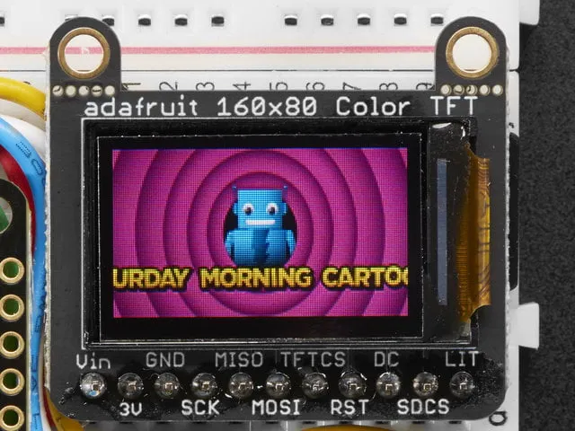

# ST7735 TFT Display Driver para ESP-IDF

Driver completo para o display **Adafruit Mini TFT 0.96" (160x80 pixels)** com controlador ST7735S, desenvolvido para **ESP32-C6** usando o framework **ESP-IDF v5.x**.



## Características

-  Suporte completo para Adafruit Mini TFT 0.96" (160x80)
-  Comunicação SPI otimizada com DMA
-  Fonte 5x7 incorporada para texto
-  4 rotações de ecrã disponíveis
-  Cores RGB565 (65K cores)
-  Funções para desenhar pixéis, retângulos e texto
-  Gestão automática de backlight (se `bl_io_num` ≥ 0, o pino é configurado como saída e colocado a HIGH durante `st7735_init()`)
-  Compatível com ESP32-C6 (única testada)

##  Hardware Necessário

| Componente              | Descrição                         |
|-------------------------|-----------------------------------|
| ESP32-C6                | Microcontrolador (ou outro ESP32) |
| Adafruit Mini TFT 0.96" | Display ST7735S 160x80            |
| Fios                    | Para conexões                     |

##  Pinout - Ligações

### Tabela de Conexões (ESP32-C6)

| Display (Adafruit) | ESP32-C6 | Descrição    |
|--------------------|----------|--------------|
| **Vin**            | 3.3V     | Alimentação  |
| **GND**            | GND      | Terra        |
| **SCK** (CLK)      | GPIO 21  | SPI Clock    |
| **SI** (MOSI)      | GPIO 19  | SPI Data     |
| **TCS** (CS)       | GPIO 22  | Chip Select  |
| **RST**            | GPIO 3   | Reset        |
| **DC**             | GPIO 2   | Data/Command |
| **Lite** (BL)      | GPIO 15  | Backlight    |

### Diagrama de Ligação

```
ESP32-C6                    Adafruit Mini TFT 0.96"
┌─────────┐                 ┌─────────────────────┐
│         │                 │                     │
│  GPIO19 ├─────────────────┤ SI (MOSI)           │
│  GPIO21 ├─────────────────┤ SCK (Clock)         │
│  GPIO22 ├─────────────────┤ TCS (Chip Select)   │
│  GPIO2  ├─────────────────┤ DC (Data/Command)   │
│  GPIO3  ├─────────────────┤ RST (Reset)         │
│  GPIO15 ├─────────────────┤ Lite (Backlight)    │
│         │                 │                     │
│   3.3V  ├─────────────────┤ Vin                 │
│   GND   ├─────────────────┤ GND                 │
└─────────┘                 └─────────────────────┘
```

##  Estrutura do Projeto

```
TFT/
├── CMakeLists.txt              # Configuração CMake principal
├── sdkconfig                   # Configuração ESP-IDF
├── README.md                   # Este ficheiro
├── main/
│   ├── CMakeLists.txt          # CMake do componente main
│   └── main.c                  # Aplicação de exemplo
└── components/
    └── st7735_driver/
        ├── CMakeLists.txt      # CMake do driver
        ├── include/
        │   ├── st7735.h        # Header principal
        │   ├── st7735_commands.h # Comandos ST7735
        │   └── graphics.h      # Header de gráficos
        └── src/
            ├── st7735.c        # Implementação do driver
            └── graphics.c      # Implementação de gráficos
```

##  Instalação e Uso

### 1. Pré-requisitos

- ESP-IDF v5.0 ou superior instalado
- Variáveis de ambiente configuradas (`source ~/esp/esp-idf/export.sh`)

### 2. Clonar/Copiar o Projeto

```bash
git clone <url-do-repositorio>
cd TFT
```

### 3. Configurar os Pinos (se necessário)

Editar `main/main.c` para alterar os pinos:

```c
#define PIN_MOSI 19   // Pino SPI MOSI
#define PIN_CLK  21   // Pino SPI Clock  
#define PIN_CS   22   // Pino Chip Select
#define PIN_DC   2    // Pino Data/Command
#define PIN_RST  3    // Pino Reset
#define PIN_BL   15   // Pino Backlight
```

### 4. Compilar

```bash
idf.py build
```

### 5. Flash e Monitor

```bash
idf.py -p /dev/ttyACM0 flash monitor
```

(Substituir `/dev/ttyACM0` pela porta correta)

##  API do Driver

### Inicialização

```c
#include "st7735.h"

st7735_config_t cfg = {
    .mosi_io_num = 19,
    .sclk_io_num = 21,
    .cs_io_num = 22,
    .dc_io_num = 2,
    .rst_io_num = 3,
    .bl_io_num = 15,       // -1 se não usado
    .host_id = SPI2_HOST
};

esp_err_t ret = st7735_init(&cfg);
if (ret != ESP_OK) {
    // Erro na inicialização
}
```

### Funções Disponíveis

| Função                                           |  Descrição                      |
|--------------------------------------------------|---------------------------------|
| `st7735_init(cfg)`                               | Inicializa o display            |
| `st7735_fill_screen(color)`                      | Preenche o ecrã com uma cor     |
| `st7735_draw_pixel(x, y, color)`                 | Desenha um pixel                |
| `st7735_fill_rect(x, y, w, h, color)`            | Desenha um retângulo preenchido |
| `st7735_draw_char(x, y, c, color, bg, size)`     | Desenha um caractere            |
| `st7735_draw_string(x, y, str, color, bg, size)` | Desenha uma string              |
| `st7735_set_rotation(0-3)`                       | Define a rotação do ecrã        |
| `st7735_invert_display(true/false)`              | Inverte as cores                |
| `st7735_get_width()`                             | Obtém a largura atual do ecrã   |
| `st7735_get_height()`                            | Obtém a altura atual do ecrã    |

### Cores Predefinidas (RGB565)

```c
ST7735_BLACK   // Preto
ST7735_WHITE   // Branco
ST7735_RED     // Vermelho
ST7735_GREEN   // Verde
ST7735_BLUE    // Azul
ST7735_CYAN    // Ciano
ST7735_MAGENTA // Magenta
ST7735_YELLOW  // Amarelo
ST7735_ORANGE  // Laranja
ST7735_GRAY    // Cinzento
```

### Criar Cores Personalizadas

```c
// Macro para criar cor RGB565
#define ST7735_RGB565(r, g, b) ((((r) & 0xF8) << 8) | (((g) & 0xFC) << 3) | ((b) >> 3))

uint16_t minha_cor = ST7735_RGB565(255, 128, 64);  // Laranja claro
```

##  Rotações do Display

| Valor | Orientação                 | Dimensões |
|-------|----------------------------|-----------|
| 0     | Portrait (normal)          | 80x160    |
| 1     | Landscape (90°)            | 160x80    |
| 2     | Portrait invertido (180°)  | 80x160    |
| 3     | Landscape invertido (270°) | 160x80    |

```c
st7735_set_rotation(1);  // Landscape 160x80
```

##  Exemplos de Uso

### Exemplo 1: Limpar Ecrã e Mostrar Texto

```c
st7735_fill_screen(ST7735_BLACK);
st7735_draw_string(10, 30, "Ola Mundo!", ST7735_WHITE, ST7735_BLACK, 2);
```

### Exemplo 2: Desenhar Retângulos

```c
// Retângulo vermelho
st7735_fill_rect(10, 10, 50, 30, ST7735_RED);

// Retângulo verde
st7735_fill_rect(70, 10, 50, 30, ST7735_GREEN);
```

### Exemplo 3: Desenhar Linhas

```c
// Linha horizontal
st7735_fill_rect(0, 40, 160, 1, ST7735_WHITE);

// Linha vertical
st7735_fill_rect(80, 0, 1, 80, ST7735_WHITE);
```

##  Como Funciona o Driver

### Arquitetura

```
┌─────────────────────────────────────────────────────────┐
│                      Application                        │
├─────────────────────────────────────────────────────────┤
│                         |                               │
│                         |            Graphics           │
│                         │                               │                  
│                         └───────────────────────────────┤      
│                                                         │
│                    ST7735 Driver                        │
│                                                         │
├─────────────────────────────────────────────────────────┤
│                ESP-IDF SPI Master Driver                │
├─────────────────────────────────────────────────────────┤
│                     Hardware SPI                        │
└─────────────────────────────────────────────────────────┘
```

### Sequência de Inicialização

1. **Configuração GPIO** - DC, RST, Backlight como outputs
2. **Ativação Backlight** - Liga a luz de fundo imediatamente
3. **Configuração SPI** - Bus SPI a 8MHz, Modo 0
4. **Reset Hardware** - Pulso LOW de 100ms no pino RST
5. **Software Reset** (0x01) - Reset interno do controlador
6. **Sleep Out** (0x11) - Sai do modo sleep (espera 500ms)
7. **Frame Rate Control** - Configura taxa de atualização
8. **Power Control** - Configura reguladores de tensão
9. **VCOM Control** - Configura tensão do painel
10. **Inversion ON** (0x21) - Ativa inversão (necessário para este display)
11. **MADCTL** (0x36, 0x78) - Configura rotação e ordem de cores
12. **COLMOD** (0x3A, 0x05) - Define formato RGB565 (16-bit)
13. **Gamma Correction** - Curvas de gama para melhor contraste
14. **Normal Mode** (0x13) - Modo normal de operação
15. **Display ON** (0x29) - Ativa o display

### Protocolo SPI

O display usa SPI com um pino DC (Data/Command):
- **DC = LOW** → O byte seguinte é um comando
- **DC = HIGH** → Os bytes seguintes são dados

```c
// Enviar comando
gpio_set_level(dc_pin, 0);
spi_transmit(&cmd, 1);

// Enviar dados
gpio_set_level(dc_pin, 1);
spi_transmit(data, len);
```

### Endereçamento de Memória

Para desenhar pixels, primeiro define-se a "janela" de endereços:

1. **CASET** (0x2A) - Define coluna inicial e final
2. **RASET** (0x2B) - Define linha inicial e final
3. **RAMWR** (0x2C) - Escreve dados de pixel

O display Adafruit Mini 0.96" usa **offsets** porque o painel 80x160 está montado numa matriz maior:
- **Landscape (rotação 1)**: colstart=1, rowstart=26

### Formato de Cor RGB565

Cada pixel usa 16 bits (2 bytes):
```
Bit:  15 14 13 12 11 | 10 09 08 07 06 05 | 04 03 02 01 00
      R4 R3 R2 R1 R0 | G5 G4 G3 G2 G1 G0 | B4 B3 B2 B1 B0
      └─── Red ────┘   └──── Green ────┘   └─── Blue ───┘
         (5 bits)           (6 bits)          (5 bits)
```

##  Resolução de Problemas

### Ecrã Preto (sem imagem)

1. Verificar conexões físicas (especialmente MOSI, CLK, CS)
2. Confirmar que o backlight está ligado (pino Lite)
3. Verificar se RST está a fazer o pulso corretamente
4. Confirmar alimentação 3.3V

### Cores Erradas

1. O display usa **BGR** em vez de RGB - já configurado no driver
2. Verificar valor MADCTL (0x78 para landscape)

### Imagem Descentralizada

1. Verificar offsets: `colstart=1, rowstart=26` para landscape
2. Confirmar rotação correta

### Falha SPI

1. Verificar se os pinos suportam SPI no teu ESP32
2. Reduzir velocidade SPI para 4MHz para debug
3. Verificar logs com `idf.py monitor`

##  Especificações Técnicas

| Parâmetro       | Valor                      |
|-----------------|----------------------------|
| Controlador     | ST7735S                    |
| Resolução       | 160x80 pixels              |
| Cores           | 65K (RGB565)               |
| Interface       | SPI (4-wire)               |
| Velocidade SPI  | 8 MHz (suporta até 32 MHz) |
| Tensão          | 3.3V                       |
| Tamanho Ecrã    | 0.96 polegadas             |
| Corrente Típica | ~20mA                      |

##  Licença

Este projeto é disponibilizado como código aberto para fins educacionais.


## Autor

Guilherme Tavares

##  Créditos

- Driver desenvolvido para a cadeira de Dispositivos Conectados
- Baseado nas especificações do datasheet ST7735S
- Inspirado nas bibliotecas Adafruit GFX

---

**Nota**: Este driver foi testado com ESP32-C6 e Adafruit Mini TFT 0.96". Para outros modelos de display ST7735, podem ser necessários ajustes nos offsets e sequência de inicialização.
